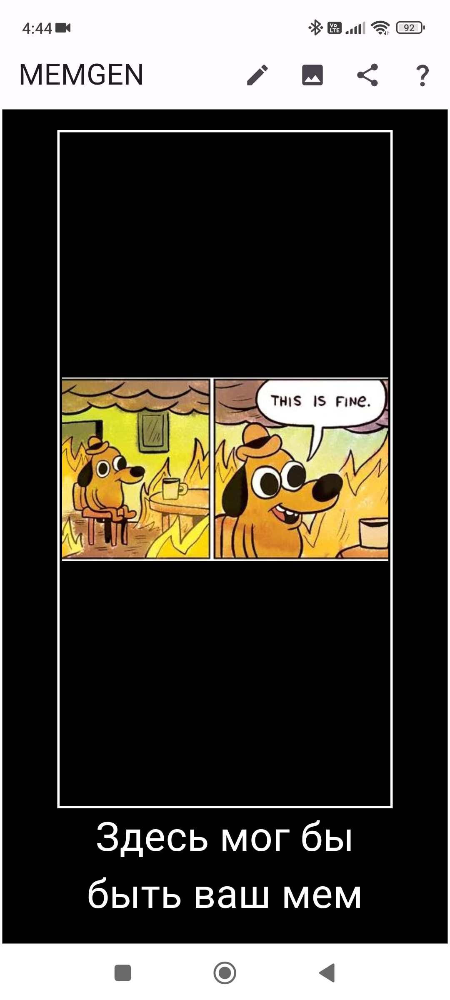
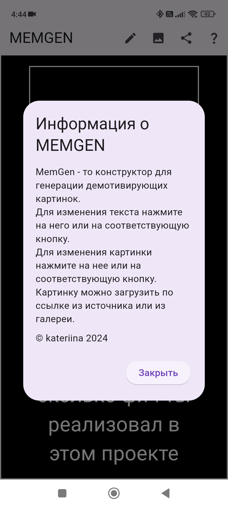
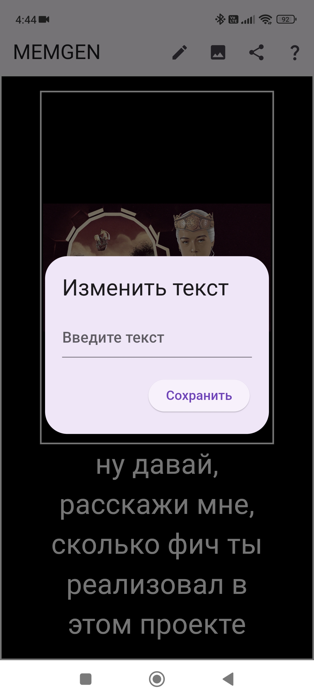
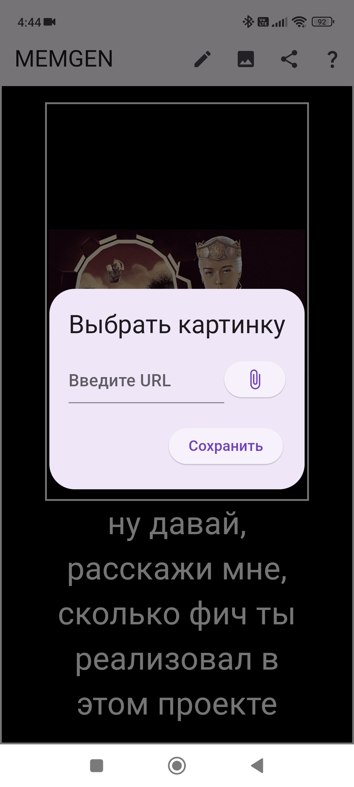
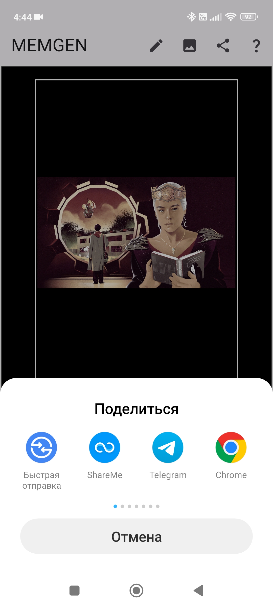
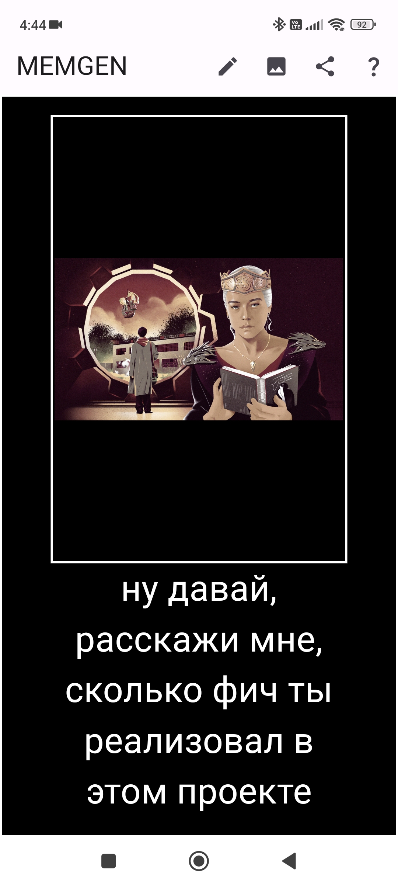
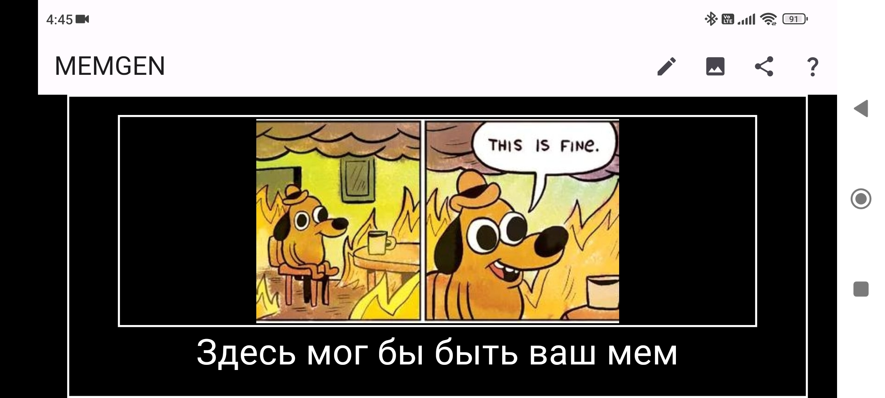

# Приложение для генерации мемов MEMGEN
## Описание
MemGen - это конструктор для генерации демотивирующих картинок. Приложение состоит из одного экрана, на котором отображается картинка и текст мема.
## Целевая платформа
Платформа: Android 12.

## Результаты
### Функционал приложения
Функционал приложения соответствует требованиям, выдвинутым к среднему уровню:

✅ возможность ввести текст (TextField),

✅ возможность выбрать картинку из интернета по ссылке (cached_network_image),

✅ возможность выбрать картинку из галереи (image_picker),

✅ возможность делиться ссылкой на картинку полученного демотиватора:

>🟢ссылка действительна только для изображений, загруженных из интернета (share_plus),
  
>🟡если изображение выбрано из галереи, передается путь к изображению в памяти телефона,
  
>🟡передается ссылка исключительно на изображение, без включения текста.

✨ изменение размера выделенной области для текста при необходимости (LayoutBuilder),

✨ возможность просмотра информации о приложении (AlertDialog),

✨ иконка приложения (android:icon).
 
### Способ взаимодействия с текстом

✏️ Взаимодействие с текстом происходит путём нажатия на него или на соответсвующую кнопку в меню приложения (GestureDetector).

### Способ взаимодействия с изображением

🖼️ Взаимодействие с изображением происходит аналогично подобным действиям с текстом.

### Бонусные опции

🔥 Адаптив под альбомную ориентацию - приложение корректно запускается и отображается в альбомной ориентации (Expanded).

## Демонстрация работы

**Видео с озвучкой**

https://github.com/Kateriina/surf-flutter-study-jam-5/assets/47224878/0d8e492d-25d2-4675-8a8a-bc444c76ff6d

**Скриншоты**

  
  

  
  

  
  

  

